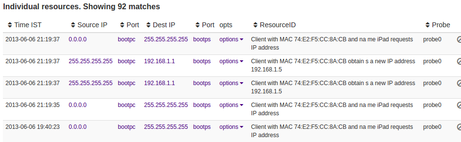
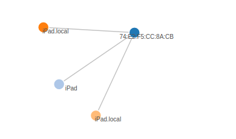

DHCP Logger 
============

This example is a fully functional DHCP logger written in plain LUA using BITMAUL.  In this example, the DHCP Dissector is plugged into the [TrisulNSM platform](https://trisul.org/docs/lua) , but it can be used on other network analytics platforms too. 


### What is logged? meta data of interest to network and security monitoring

We want to save DHCP activity in plain English log messages.  In particular we want to log Client IP address lease activity. This can enrich visibility tie down L2 to L3 mapping.  The following image shows a sample output.




## Running the example

Just drop  the contents of this folder into the Trisul Probe LUA directory along with the `sweepbuf.lua` file from the BITMAUL library. 

````
cp sweepbuf.lua /usr/local/var/lib/trisul-probe/domain0/probe0/context0/config/local-lua
cp *.lua /usr/local/var/lib/trisul-probe/domain0/probe0/context0/config/local-lua

Restart Trisul Probe

````


## Explanation

The files in this directory are divided into two categories.

Code that dissects the DHCP packet

 - `dhcp-dissect.lua` : The main BITMAUL action is here 
 - `dhcp-enums.lua` : DHCP message types and other enums from IANA to decode 

Plumbing code that interfaces with Trisul

 - `dhcp-trisul-protocol.lua` : Creates a new protocol for DHCP over UDP port 67,68 [ [API](https://trisul.org/docs/lua/protocol_handler.html) ]
 - `dhcp-trisul-resource.lua` : Simple def for a new DHCP resource / log type [ [API](https://trisul.org/docs/lua/resource_group.html)]
 - `dhcp-trisul-counter.lua` : This receives the raw DHCP packet and adds the output data to Trisul streams  [ [API](https://trisul.org/docs/lua/simple_counter.html)]


## BITMAUL techniques shown

The entire dissection is just one LUA file less than 100 lines !!  We shoot to be concise as well as to have all the "handlers" in the flow of the code rather than placing them outside.   Since DHCP is UDP based we dont use the BITMAUL component PDURecord. 

The main technique is 

 - we keep the parsing and the app separate. 
 - the dhcp-dissect parses the payload and builds a LUA table
 - outside code generate the log messages from the table 


There are also some shortcuts like `next_uN()` demonstrated in this example 

```
	return string.format("%d seconds", swb:next_uN(swb:next_u8()))

	safely handles protocol specifications like

	[1-byte-length-field N][  N byte number field ]
```

## What is added to Trisul

The DHCP log contains 
 - summary in plain English and the JSON of the entire DHCP for the REQUEST,ACK messages


The code also addes EDGES to Trisul Graph Analytics, this is a life saver when you want to navigate from L2 to L3 entities. 

Imagine you have to answer these questions

 - What IP addresses did MAC address 'X' have ? 
 - What is the Host name for MAC address 'X' ? 


The following code adds an EDGE from MAC -> IP and then IP -> MAC. Remember Trisul Edges are Uni-Directional.  See [engine:add_edge(..)](https://www.trisul.org/docs/lua/obj_engine.html#function_add_edge)


````
function add_trisul_edges(engine, fields)

   --
	if optstr == "5 DHCPACK" then 
	  engine:add_edge(
	  		  "{4B09BD22-3B99-40FC-8215-94A430EA0A35}",  fields.chaddr, 
	          "{4CD742B1-C1CA-4708-BE78-0FCA2EB01A86}",  ip_to_key(fields.yiaddr) )

	  engine:add_edge(
	  	      "{4CD742B1-C1CA-4708-BE78-0FCA2EB01A86}",  ip_to_key(fields.yiaddr), 
	          "{4B09BD22-3B99-40FC-8215-94A430EA0A35}",  fields.chaddr )
	end

end 

````

To produce this output




## Viewing the data in Trisul

 - To view Logs :  Go to Resources -> All Resources -> DHCP to start searching.
 - For graph analytics : Click on a MAC address vertex to expose its DHCP neigbours. 
