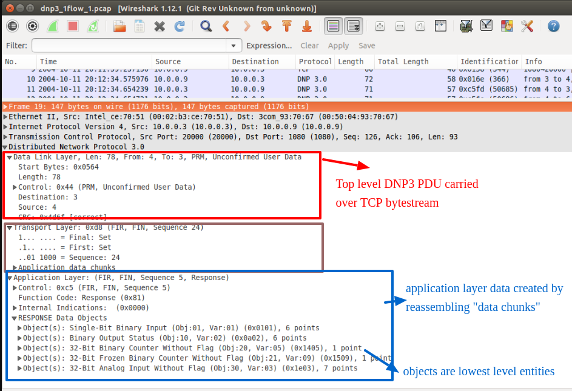

DNP3 analyzer 
=============

Another example of BITMAUL.  

We chose a relatively complex protocol [DNP3 protocol](https://www.dnp.org/Pages/AboutDefault.aspx) to show how BITMAUL can make it dramatically easier to write dissectors. 

## Explanation

First a bit about the DNP3 protocol. DNP stands for Distrbuted Network Protocol , it is used mainly in industrial control systems.  The DNP3 protocol typically runs on top of TCP, but with its own transport layer. After extracting the DNP3 PDU, you have to reassemble "application data chunks" to get the full message. 

The stack looks like this on Wireshark.





We break the task into three parts.

1. Use PDURecord to get DNP3 PDUs from a bytestream 
2. Use SweepBuf to parse the "DNP3 data link layer chunks" and verify Checksum
3. Construct new messages from chunks and parse the DNP3 objects

### dnp3.lua 

Just print the DNP3 fields. 

The dnp3.lua uses PDURecord.  The file is well documented so you know whats going on, but here is a summary

- `what_next(..)` - uses the Length parameter to mark out DNP3 PDUs on TCP stream. There is a little calculation that is there to adjust for the checksums, which are not included in the length field.
- `on_record(..)` - a full DNP3 PDU. Print fields as they are extracted, verify the checksum. Loop over the application data chunks and create the DNP3 Message body.
- `parse_dn3_object(..)` - Loops over DNP3 object fields. DNP3 is a bit complex in the way you calculate object lengths. This method outlines the ways you can do that easily. The tables like `DNP_Group_Var_Bitlength` can be found in `enums.lua`. To build a complete DNP3 dissector, you just have to flesh out this method. 


We found developing dissectors using this approach to be several TIMES faster than other frameworks used by tools like Wireshark or Bro IDS. 


### Running

To run over a saved TCP stream

````
$ luajit test_file.lua  data/dnp.2.flow.dat
magic =25605
length =8
control =196
destination =4
source =3
crc =47284
calccrc =47284
transport_flag  =192
00000000 C1 0D                                              ..
Function Code = COLD_RESTART
-------------------
magic =25605
length =10

..


````


## Credits

1. I found the DNP3 PCAP file from https://github.com/automayt/ICS-pcap  
2. DNP3 Specification PDF : https://www.dnp.org/DNP3Downloads/DNP3%20AN2013-004b%20Validation%20of%20Incoming%20DNP3%20Data.pdf


