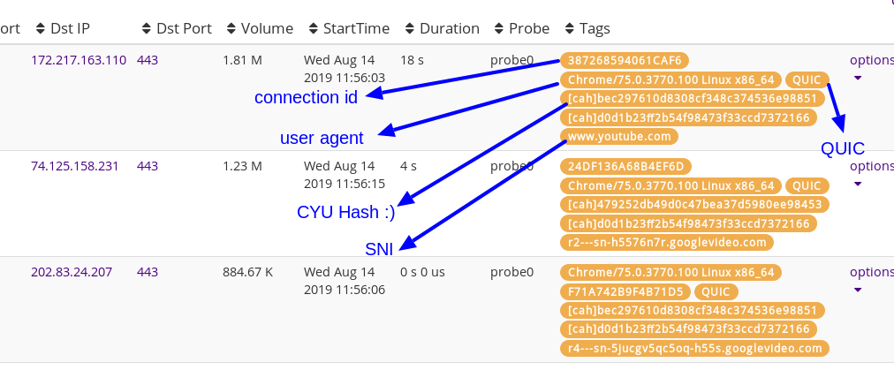

# QUIC Protocol for Trisul

This Bitmaul example script performs a decode of the *GQUIC Crypto handshake* 
Google streaming services are increasingly moving to the GQUIC protocol.

## What `quic-dissect.lua`  does 

   1.  attaches a new Protocol (Google-QUIC) to UDP port 443
   2.  performs a decode of the crypto handshake CHLO and REJ messages into a LUA table
   3.  tags UDP flow with QUIC connection IDs and QUIC tag 
   4.  tags UDP flow with SNI from CHLO 
   5.  basic reassembly to pick up fragmented CRYPTO handshake 
   6.  Extracts the X.509 certificate after decompression from the REJ message 

## UPDATES
* Aug-25-2019     Updated to support the latest GQUIC version Q046, support for older Q043 removed 
                  also added a [Fingerprint](https://engineering.salesforce.com/gquic-protocol-analysis-and-fingerprinting-in-zeek-a4178855d75f) 

## Links

* The version supported is **Google QUIC Version Q046**  , earlier versions are not supported 
* Link to the [Google GUID CRYPTO Protocol](https://github.com/romain-jacotin/quic/blob/master/doc/QUIC_crypto_protocol.md) we are working with here. 
* [Trisul LUA Scripting](https://www.trisul.org/docs/lua/)
* [BITMAUL Protocol Dissection Library](https://github.com/trisulnsm/bitmaul) 
* [SweepBuf from BITMAUL helps you parse packets](https://github.com/trisulnsm/bitmaul/blob/master/SWEEPBUF.md)
* [CRYPTO Certificate Chain format](https://docs.google.com/document/d/1g5nIXAIkN_Y-7XJW5K45IblHd_L2f5LTaDUDwvZ5L6g/edit#) 

## Example Inchoate Client Hello CHLO 

From the 1st packet, which is the so called "Inchoate CHLO" - we extract out the  ConnectionID, SNI, Client User Agent  ID (CUID). 
The information extracted into a LUA table by the quic-dissect.lua which can be easily processed by the NSM packet handler script.

````lua
{
  cid_hi = 643620114,
  cid_lo = 2665768574,
  cid_str = "265CDD129EE4667E",
  data_length = 1300,
  flags = { 0, 0, 0, 1, 1, 0, 1 },
  mac_hash = "EE1836F6C14D4B3B3C62B3E1",
  pkt_number = 1,
  pkt_number_len = 1,
  stream_flags = {
    data_length = 1,
    fin = 0,
    offset_length = 0,
    stream = 1,
    stream_length = 0
  },
  stream_id = 1,
  tag = "CHLO",
  tag_count = 18,
  tag_offsets = { { "PAD\0", 1007 }, { "SNI\0", 1023 }, { "VER\0", 1027 }, { "CCS\0", 1043 }, { "MSPC", 1047 }, { "UAID", 1080 }, { "TCID", 1084 }, { "PDMD", 1088 }, { "SMHL", 1092 }, { "ICSL", 1096 }, { "NONP", 1128 }, { "MIDS", 1132 }, { "SCLS", 1136 }, { "CSCT", 1136 }, { "COPT", 1136 }, { "IRTT", 1140 }, { "CFCW", 1144 }, { "SFCW", 1148 } },
  tag_sni = "www.google.co.in",
  tag_user_agent = "Chrome/68.0.3440.106 Linux x86_64",
  version = "Q043"
}

````

## How to use in Trisul

Just dump `*.lua` files from this directory and also `sweepbuf.lua` from the root directory of this repo into the local-lua directory on the probe. 
Then restart the Trisul probe.

### 1. live capture  mode 
````
cp allthefiles.lua  /usr/local/var/lib/trisul-probe/domain0/probe0/context0/config/local-lua
trisulctl_probe restart context default
````

### 2. read pcap file  mode 
````
cp allthefiles.lua  /usr/local/var/lib/trisul-probe/domain0/probe0/context0/config/local-lua
trisulctl_probe importpcap /home/mike/quic-packets.pcap 
````

### Query flows by QUIC 

1. Go to *Tools/Explore Flows* , then query by `tag=QUIC` 
2. This picks up all UDP flows tagged as QUIC and prints out the flows with the tags
3. This simple scripts tags each flow with the labels _QUIC, User-Agent, SNI, QUIC Connection ID_ 
4. See screenshot below 

 


### View QUIC certificates 

This script also extracts X.509 certificates sent by the server in the REJ message. Much like the "Server Certificate" in TLS.


1. Go to *Resources/View All*  
2. Click on the *SSL Certs*, then press *Search* to list all certificates seen
3. You can see the extracted certificates as shown below


 

